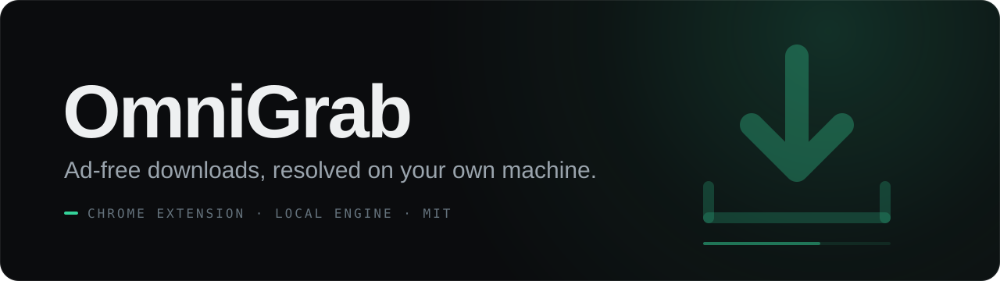
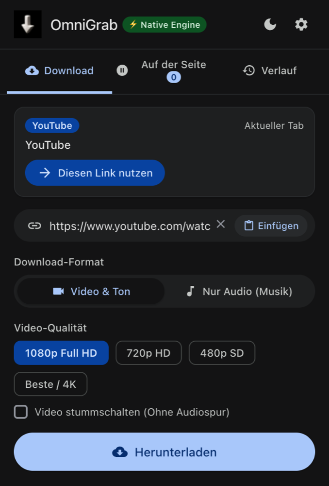
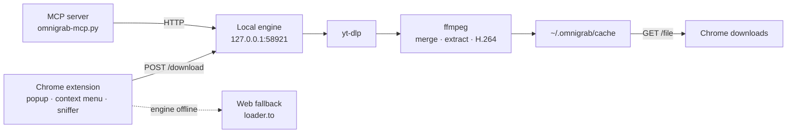

<p align="center"></p>

<p align="center">
  
  
  
  
  
</p>

<p align="center">🇩🇪 <a href="docs/HANDBUCH.md">Deutsches Handbuch</a></p>

**OmniGrab downloads video and audio from the sites you already use, without ads, redirects or sketchy converter pages.**
A Chrome extension picks up the link; a small Python engine on your own machine resolves it with yt-dlp and ffmpeg and writes a clean file.
It also ships an MCP server, so AI agents can use the same engine.

<p align="center"></p>

## Highlights

- **Current tab, one click.** The popup detects the video you are watching and offers "Diesen Link nutzen" (use this link).
- **Paste or right-click.** Paste any link from the clipboard, or right-click a link, video or page and choose "Mit OmniGrab herunterladen".
- **In-page media sniffer.** A content script finds embedded `<video>` and `<audio>` streams on ordinary web pages and lists them under "Auf der Seite".
- **Quality you choose.** Video in 480p, 720p, 1080p or best available (up to 4K), with an option to drop the audio track. Audio as MP3, WAV or OPUS.
- **Files that play everywhere.** When a site delivers VP9 or AV1, the engine re-encodes the video track to H.264 so QuickTime and macOS play it, leaving the audio untouched.
- **Portrait video done right.** Reels, Shorts and TikToks are matched by their short side, so "1080p" means 1080p for vertical video too.
- **Download history.** Recent downloads stay in the popup, together with light, dark and system themes.
- **Agent-ready.** `engine/omnigrab-mcp.py` exposes `omnigrab_status`, `omnigrab_download` and `omnigrab_progress` over MCP and starts the engine if it is not running.

| Platform | What you get |
|---|---|
| YouTube | Videos, Shorts, music |
| Instagram | Reels, posts, stories |
| TikTok | Videos |
| X / Twitter | Videos, GIFs |
| Reddit | Videos with their audio track |
| SoundCloud | Tracks |
| Vimeo, Pinterest, Facebook | Videos, plus other sites yt-dlp supports |

## Quick start

**Requirements:** macOS with Homebrew, Google Chrome (or Brave, Edge, Opera), Python 3, yt-dlp and ffmpeg.

```bash
brew install yt-dlp ffmpeg
git clone https://github.com/OskarSch24/omnigrab.git
cd omnigrab
```

**1. Run the engine.** Pick one:

```bash
# Start it once, in the background (log: engine/engine.log)
bash engine/start-engine.sh

# Or install it as a launch agent that starts at login and restarts on failure
bash engine/install-service.sh
```

Both listen on `http://127.0.0.1:58921`. Check it with:

```bash
curl http://127.0.0.1:58921/health
```

**2. Load the extension.**

1. Open `chrome://extensions`.
2. Turn on **Developer mode** (top right).
3. Click **Load unpacked** and select the cloned `omnigrab` folder.
4. Pin OmniGrab from the puzzle-piece menu.

The popup shows a "Native Engine" badge when it can reach the engine. The engine works in `~/.omnigrab/cache`; Chrome then saves the finished file to your normal download folder.

**3. Optional: connect an agent.** Register `engine/omnigrab-mcp.py` as a stdio MCP server in your client (it uses only the Python standard library):

```bash
python3 engine/omnigrab-mcp.py
```

## Privacy

- **No API keys, no accounts.** Nothing to sign up for.
- **No telemetry.** The extension contains no analytics or tracking code. Settings and history live in `chrome.storage.local`.
- **Local first.** Downloads go to the engine on `127.0.0.1:58921`, which only binds to localhost.
- **One fallback to know about.** If the local engine is not running or fails, the extension falls back to a public web converter (`loader.to`) and sends it the media URL. Keep the engine running if you want every request to stay on your machine.

## How it works



The extension polls `/progress` while yt-dlp works, then hands the file URL to Chrome's download manager. Agents get the same `download_url` back from `omnigrab_progress`.

## Project structure

```
omnigrab/
├── manifest.json          Chrome MV3 manifest
├── background/            service worker: engine calls, context menu, fallback
├── content/scanner.js     in-page <video>/<audio> sniffer
├── popup/                 the popup UI
├── options/               settings page (default quality, audio format, theme)
├── engine/
│   ├── omnigrab-engine.py   local HTTP engine (yt-dlp + ffmpeg)
│   ├── omnigrab-mcp.py      MCP server for agents
│   ├── start-engine.sh      start the engine in the background
│   └── install-service.sh   install as a macOS launch agent
├── icons/                 extension icons
├── scripts/               icon generator
└── docs/HANDBUCH.md       German manual
```

## Responsible use

OmniGrab is a tool for saving media you are allowed to save: your own uploads, openly licensed work, or content whose owner permits downloading. Respect each platform's terms of service and the copyright of the people who made the content. You are responsible for what you download and how you use it.

## License

[MIT](LICENSE)

---

<p align="center"><sub>Built by <a href="https://github.com/OskarSch24">Oskar Schiermeister</a> · Asking More Questions OÜ</sub></p>
